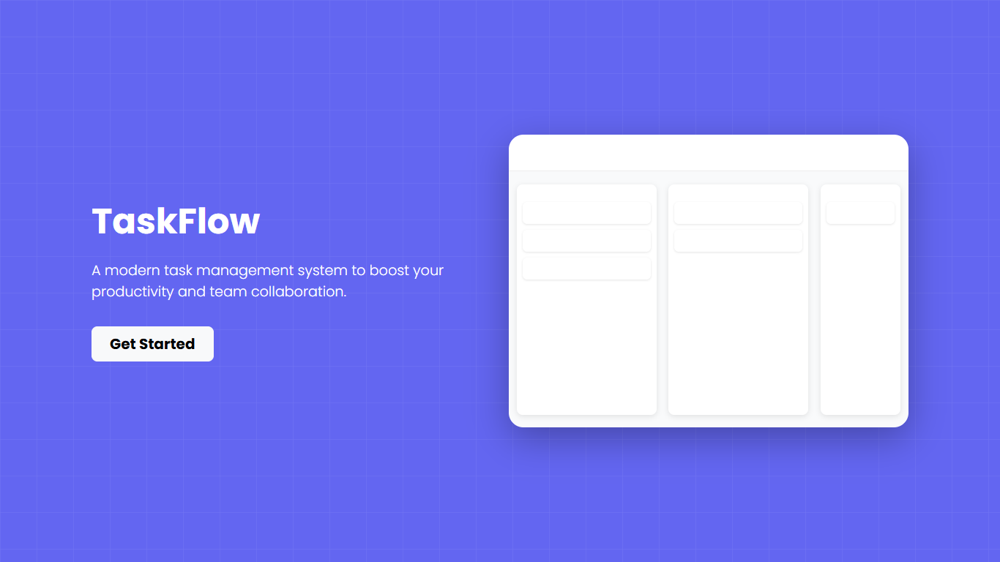
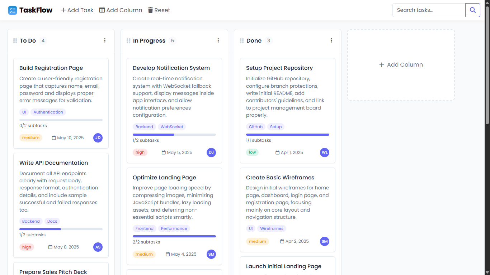
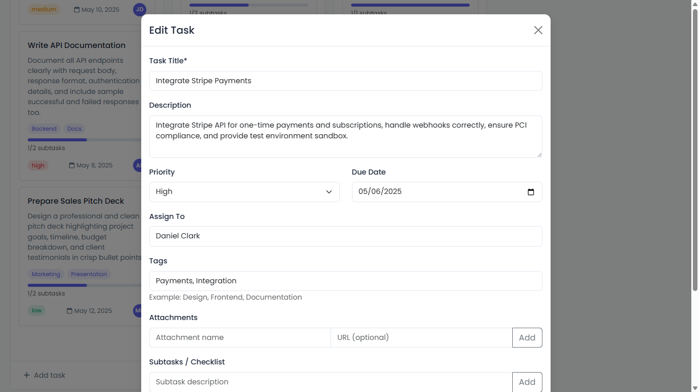

# FlowBoard - Simple Kanban Organizer

[](https://taskflowapp.pages.dev/)

FlowBoard is a lightweight, user-friendly kanban board for organizing your tasks and projects. Designed for individuals and small teams, it offers a clean interface and essential features for productivity.

## ✨ Features

- **Drag-and-Drop Simplicity**: Move cards easily between lanes
- **Flexible Lanes**: Add and edit lanes as needed
- **Detailed Cards**: Description, date, priority, assignee, tags, attachments, subtasks, and comments
- **Quick Search**: Instantly filter cards
- **Mobile Friendly**: Works smoothly on all devices
- **Data Privacy**: All data is stored in your browser

---

## 📸 Screenshots

*App welcome screen.*


*Main kanban board view.*


*Card details modal.*

---

## 💻 Technologies Used

- HTML5
- CSS3
- JavaScript (Vanilla)
- Bootstrap 5
- Font Awesome
- Google Fonts (Roboto)
- SweetAlert2

## 🚀 Getting Started

### Online Demo

Try it now: [FlowBoard Demo](https://taskflowapp.pages.dev/)

### Local Installation

1. Clone the repository:
   ```bash
   git clone https://github.com/caqri/caqri-flowboard.git
   ```
2. Go to the project folder:
   ```bash
   cd caqri-flowboard
   ```
3. Open `index.html` in your browser.

## 📱 Usage

- **Start**: Click the "Start Now" button on the intro screen.
- **Add Lane**: Use "Add Lane" to create a new lane.
- **Add Card**: Use "Add Item" to add a new card, fill in details, and save.
- **Manage Cards**: Click cards to edit, drag to move, use the search box to filter.
- **Reset Data**: Click "Reset" to clear all data.

## 🏗️ File Structure

- `index.html`: Main HTML file
- `styles.css`: Stylesheet
- `scripts.js`: JavaScript functions
- `assets/`: Images and icons

## 🔒 Data Privacy

All data is stored only in your browser and never sent externally.

## 🔧 Customization

You can change colors and theme by editing CSS variables in `styles.css`.

## 🤝 Contributing

To contribute:
1. Fork the repository
2. Create a new branch (`git checkout -b feature-new`)
3. Commit your changes (`git commit -m 'Add new feature'`)
4. Push the branch (`git push origin feature-new`)
5. Open a Pull Request


---
